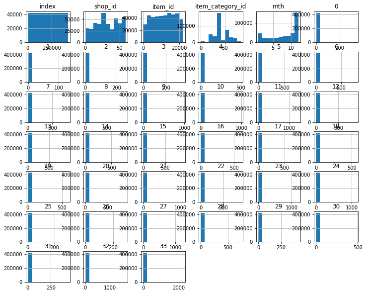

```python
###   load the required libraries
import pandas as pd
import numpy as np
import os
import matplotlib.pyplot as plt

###   set some configurations for plots
plt.rcParams['figure.figsize'] = (12,10)
pd.set_option('display.max_columns', None)
```


```python
###   read in the data files
path = r'C:\Users\eight\Desktop\Kelvin HDD\3. Coursera\A. Projects\6. Predict future sales --- Kaggle\competitive-data-science-predict-future-sales'
os.chdir(path)

item_cat = pd.read_csv("item_categories.csv")
items = pd.read_csv("items.csv")
shops = pd.read_csv("shops.csv")
sales_train = pd.read_csv("sales_train.csv")
sales_test = pd.read_csv("test.csv")
df = sales_train.copy()
df.dtypes
```


    date               object
    date_block_num      int64
    shop_id             int64
    item_id             int64
    item_price        float64
    item_cnt_day      float64
    dtype: object


```python
###   take a look at a sample of the files
print(item_cat.head())
print(items.head())
print(shops.head())
print(sales_train.head())
print(sales_train.tail())
print(sales_test.head())
```

            item_category_name  item_category_id
    0  PC - Гарнитуры/Наушники                 0
    1         Аксессуары - PS2                 1
    2         Аксессуары - PS3                 2
    3         Аксессуары - PS4                 3
    4         Аксессуары - PSP                 4
                                               item_name  item_id  \
    0          ! ВО ВЛАСТИ НАВАЖДЕНИЯ (ПЛАСТ.)         D        0   
    1  !ABBYY FineReader 12 Professional Edition Full...        1   
    2      ***В ЛУЧАХ СЛАВЫ   (UNV)                    D        2   
    3    ***ГОЛУБАЯ ВОЛНА  (Univ)                      D        3   
    4        ***КОРОБКА (СТЕКЛО)                       D        4   
    
       item_category_id  
    0                40  
    1                76  
    2                40  
    3                40  
    4                40  
                            shop_name  shop_id
    0   !Якутск Орджоникидзе, 56 фран        0
    1   !Якутск ТЦ "Центральный" фран        1
    2                Адыгея ТЦ "Мега"        2
    3  Балашиха ТРК "Октябрь-Киномир"        3
    4        Волжский ТЦ "Волга Молл"        4
             date  date_block_num  shop_id  item_id  item_price  item_cnt_day
    0  02.01.2013               0       59    22154      999.00           1.0
    1  03.01.2013               0       25     2552      899.00           1.0
    2  05.01.2013               0       25     2552      899.00          -1.0
    3  06.01.2013               0       25     2554     1709.05           1.0
    4  15.01.2013               0       25     2555     1099.00           1.0
                   date  date_block_num  shop_id  item_id  item_price  \
    2935844  10.10.2015              33       25     7409       299.0   
    2935845  09.10.2015              33       25     7460       299.0   
    2935846  14.10.2015              33       25     7459       349.0   
    2935847  22.10.2015              33       25     7440       299.0   
    2935848  03.10.2015              33       25     7460       299.0   
    
             item_cnt_day  
    2935844           1.0  
    2935845           1.0  
    2935846           1.0  
    2935847           1.0  
    2935848           1.0  
       ID  shop_id  item_id
    0   0        5     5037
    1   1        5     5320
    2   2        5     5233
    3   3        5     5232
    4   4        5     5268
    


```python
# convert 'date' column into type "datetime"
from datetime import datetime
df.date = pd.to_datetime(df.date, format = "%d.%m.%Y")
df.dtypes
print(df.head(10))
```

            date  date_block_num  shop_id  item_id  item_price  item_cnt_day
    0 2013-01-02               0       59    22154      999.00           1.0
    1 2013-01-03               0       25     2552      899.00           1.0
    2 2013-01-05               0       25     2552      899.00          -1.0
    3 2013-01-06               0       25     2554     1709.05           1.0
    4 2013-01-15               0       25     2555     1099.00           1.0
    5 2013-01-10               0       25     2564      349.00           1.0
    6 2013-01-02               0       25     2565      549.00           1.0
    7 2013-01-04               0       25     2572      239.00           1.0
    8 2013-01-11               0       25     2572      299.00           1.0
    9 2013-01-03               0       25     2573      299.00           3.0
    


```python
###   create a function to obtain the month info
def create_period(df):
    
    get_mth = lambda x: x.strftime('%m')
    df['mth'] = df.date.apply(get_mth)
    df.mth = df.mth.astype('int64')
    
    #get_yr_mth = lambda x: x.strftime('%Y-%m')    
    #df['yr_mth'] = df.date.apply(get_yr_mth)    
    
    return df
```


```python
# create month info 
df_period = create_period(df)
```


```python
#pivot_df = df_period.pivot_table(index = ['shop_id', 'item_id', 'item_price', 'mth'], 
pivot_df = df_period.pivot_table(index = ['shop_id', 'item_id', 'mth'], 
                                 values = 'item_cnt_day',
                                 columns = 'date_block_num',
                                 aggfunc = 'sum').fillna(0.0)

# with 'item_price' included, the RMSE is 0.6640
# 'item_price' NOT included, the RMSE is 1.10577

df2 = pivot_df.reset_index()
print(df2.head())
```

    date_block_num  shop_id  item_id  mth    0     1    2    3    4    5    6  \
    0                     0       30    2  0.0  31.0  0.0  0.0  0.0  0.0  0.0   
    1                     0       31    2  0.0  11.0  0.0  0.0  0.0  0.0  0.0   
    2                     0       32    1  6.0   0.0  0.0  0.0  0.0  0.0  0.0   
    3                     0       32    2  0.0  10.0  0.0  0.0  0.0  0.0  0.0   
    4                     0       33    1  3.0   0.0  0.0  0.0  0.0  0.0  0.0   
    
    date_block_num    7    8    9   10   11   12   13   14   15   16   17   18  \
    0               0.0  0.0  0.0  0.0  0.0  0.0  0.0  0.0  0.0  0.0  0.0  0.0   
    1               0.0  0.0  0.0  0.0  0.0  0.0  0.0  0.0  0.0  0.0  0.0  0.0   
    2               0.0  0.0  0.0  0.0  0.0  0.0  0.0  0.0  0.0  0.0  0.0  0.0   
    3               0.0  0.0  0.0  0.0  0.0  0.0  0.0  0.0  0.0  0.0  0.0  0.0   
    4               0.0  0.0  0.0  0.0  0.0  0.0  0.0  0.0  0.0  0.0  0.0  0.0   
    
    date_block_num   19   20   21   22   23   24   25   26   27   28   29   30  \
    0               0.0  0.0  0.0  0.0  0.0  0.0  0.0  0.0  0.0  0.0  0.0  0.0   
    1               0.0  0.0  0.0  0.0  0.0  0.0  0.0  0.0  0.0  0.0  0.0  0.0   
    2               0.0  0.0  0.0  0.0  0.0  0.0  0.0  0.0  0.0  0.0  0.0  0.0   
    3               0.0  0.0  0.0  0.0  0.0  0.0  0.0  0.0  0.0  0.0  0.0  0.0   
    4               0.0  0.0  0.0  0.0  0.0  0.0  0.0  0.0  0.0  0.0  0.0  0.0   
    
    date_block_num   31   32   33  
    0               0.0  0.0  0.0  
    1               0.0  0.0  0.0  
    2               0.0  0.0  0.0  
    3               0.0  0.0  0.0  
    4               0.0  0.0  0.0  
    


```python
###   merge in all the relevant info into the earlier "df" for completeness and for ML
df3 = pd.merge(df2, items, how = "inner", on = "item_id")
df4 = pd.merge(df3, item_cat, how = "inner", on = "item_category_id")
df5 = pd.merge(df4, shops, how = "inner", on = "shop_id")
print(df5.head())
```

       shop_id  item_id  mth    0     1    2    3    4    5    6    7    8    9  \
    0        0       30    2  0.0  31.0  0.0  0.0  0.0  0.0  0.0  0.0  0.0  0.0   
    1        0       32    1  6.0   0.0  0.0  0.0  0.0  0.0  0.0  0.0  0.0  0.0   
    2        0       32    2  0.0  10.0  0.0  0.0  0.0  0.0  0.0  0.0  0.0  0.0   
    3        0       35    1  1.0   0.0  0.0  0.0  0.0  0.0  0.0  0.0  0.0  0.0   
    4        0       35    2  0.0  14.0  0.0  0.0  0.0  0.0  0.0  0.0  0.0  0.0   
    
        10   11   12   13   14   15   16   17   18   19   20   21   22   23   24  \
    0  0.0  0.0  0.0  0.0  0.0  0.0  0.0  0.0  0.0  0.0  0.0  0.0  0.0  0.0  0.0   
    1  0.0  0.0  0.0  0.0  0.0  0.0  0.0  0.0  0.0  0.0  0.0  0.0  0.0  0.0  0.0   
    2  0.0  0.0  0.0  0.0  0.0  0.0  0.0  0.0  0.0  0.0  0.0  0.0  0.0  0.0  0.0   
    3  0.0  0.0  0.0  0.0  0.0  0.0  0.0  0.0  0.0  0.0  0.0  0.0  0.0  0.0  0.0   
    4  0.0  0.0  0.0  0.0  0.0  0.0  0.0  0.0  0.0  0.0  0.0  0.0  0.0  0.0  0.0   
    
        25   26   27   28   29   30   31   32   33                   item_name  \
    0  0.0  0.0  0.0  0.0  0.0  0.0  0.0  0.0  0.0  007: КООРДИНАТЫ «СКАЙФОЛЛ»   
    1  0.0  0.0  0.0  0.0  0.0  0.0  0.0  0.0  0.0                         1+1   
    2  0.0  0.0  0.0  0.0  0.0  0.0  0.0  0.0  0.0                         1+1   
    3  0.0  0.0  0.0  0.0  0.0  0.0  0.0  0.0  0.0               10 ЛЕТ СПУСТЯ   
    4  0.0  0.0  0.0  0.0  0.0  0.0  0.0  0.0  0.0               10 ЛЕТ СПУСТЯ   
    
       item_category_id item_category_name                      shop_name  
    0                40         Кино - DVD  !Якутск Орджоникидзе, 56 фран  
    1                40         Кино - DVD  !Якутск Орджоникидзе, 56 фран  
    2                40         Кино - DVD  !Якутск Орджоникидзе, 56 фран  
    3                40         Кино - DVD  !Якутск Орджоникидзе, 56 фран  
    4                40         Кино - DVD  !Якутск Орджоникидзе, 56 фран  
    


```python
df5.isna().sum() # there are no NAs
```


    shop_id               0
    item_id               0
    mth                   0
    0                     0
    1                     0
    2                     0
    3                     0
    4                     0
    5                     0
    6                     0
    7                     0
    8                     0
    9                     0
    10                    0
    11                    0
    12                    0
    13                    0
    14                    0
    15                    0
    16                    0
    17                    0
    18                    0
    19                    0
    20                    0
    21                    0
    22                    0
    23                    0
    24                    0
    25                    0
    26                    0
    27                    0
    28                    0
    29                    0
    30                    0
    31                    0
    32                    0
    33                    0
    item_name             0
    item_category_id      0
    item_category_name    0
    shop_name             0
    dtype: int64


```python
# we change the order of the columns
col_order = [0,1,38,2,37,39,40] + list(range(3,37))
df5 = df5.iloc[:,col_order]
print(df5.head())
```

       shop_id  item_id  item_category_id  mth                   item_name  \
    0        0       30                40    2  007: КООРДИНАТЫ «СКАЙФОЛЛ»   
    1        0       32                40    1                         1+1   
    2        0       32                40    2                         1+1   
    3        0       35                40    1               10 ЛЕТ СПУСТЯ   
    4        0       35                40    2               10 ЛЕТ СПУСТЯ   
    
      item_category_name                      shop_name    0     1    2    3    4  \
    0         Кино - DVD  !Якутск Орджоникидзе, 56 фран  0.0  31.0  0.0  0.0  0.0   
    1         Кино - DVD  !Якутск Орджоникидзе, 56 фран  6.0   0.0  0.0  0.0  0.0   
    2         Кино - DVD  !Якутск Орджоникидзе, 56 фран  0.0  10.0  0.0  0.0  0.0   
    3         Кино - DVD  !Якутск Орджоникидзе, 56 фран  1.0   0.0  0.0  0.0  0.0   
    4         Кино - DVD  !Якутск Орджоникидзе, 56 фран  0.0  14.0  0.0  0.0  0.0   
    
         5    6    7    8    9   10   11   12   13   14   15   16   17   18   19  \
    0  0.0  0.0  0.0  0.0  0.0  0.0  0.0  0.0  0.0  0.0  0.0  0.0  0.0  0.0  0.0   
    1  0.0  0.0  0.0  0.0  0.0  0.0  0.0  0.0  0.0  0.0  0.0  0.0  0.0  0.0  0.0   
    2  0.0  0.0  0.0  0.0  0.0  0.0  0.0  0.0  0.0  0.0  0.0  0.0  0.0  0.0  0.0   
    3  0.0  0.0  0.0  0.0  0.0  0.0  0.0  0.0  0.0  0.0  0.0  0.0  0.0  0.0  0.0   
    4  0.0  0.0  0.0  0.0  0.0  0.0  0.0  0.0  0.0  0.0  0.0  0.0  0.0  0.0  0.0   
    
        20   21   22   23   24   25   26   27   28   29   30   31   32   33  
    0  0.0  0.0  0.0  0.0  0.0  0.0  0.0  0.0  0.0  0.0  0.0  0.0  0.0  0.0  
    1  0.0  0.0  0.0  0.0  0.0  0.0  0.0  0.0  0.0  0.0  0.0  0.0  0.0  0.0  
    2  0.0  0.0  0.0  0.0  0.0  0.0  0.0  0.0  0.0  0.0  0.0  0.0  0.0  0.0  
    3  0.0  0.0  0.0  0.0  0.0  0.0  0.0  0.0  0.0  0.0  0.0  0.0  0.0  0.0  
    4  0.0  0.0  0.0  0.0  0.0  0.0  0.0  0.0  0.0  0.0  0.0  0.0  0.0  0.0  
    


```python
###   create some visualisations
df5.hist()
```


    array([[<matplotlib.axes._subplots.AxesSubplot object at 0x0000024BEAA80198>,
            <matplotlib.axes._subplots.AxesSubplot object at 0x0000024BDF4BF8D0>,
            <matplotlib.axes._subplots.AxesSubplot object at 0x0000024BEAA81D30>,
            <matplotlib.axes._subplots.AxesSubplot object at 0x0000024BEAABD160>,
            <matplotlib.axes._subplots.AxesSubplot object at 0x0000024BB4D1E710>,
            <matplotlib.axes._subplots.AxesSubplot object at 0x0000024BB4D50CC0>],
           [<matplotlib.axes._subplots.AxesSubplot object at 0x0000024BB4DEC2B0>,
            <matplotlib.axes._subplots.AxesSubplot object at 0x0000024BB649C898>,
            <matplotlib.axes._subplots.AxesSubplot object at 0x0000024BB649C8D0>,
            <matplotlib.axes._subplots.AxesSubplot object at 0x0000024BB650A400>,
            <matplotlib.axes._subplots.AxesSubplot object at 0x0000024BB653B9B0>,
            <matplotlib.axes._subplots.AxesSubplot object at 0x0000024BB656DF60>],
           [<matplotlib.axes._subplots.AxesSubplot object at 0x0000024BB65A9550>,
            <matplotlib.axes._subplots.AxesSubplot object at 0x0000024BB65D8B00>,
            <matplotlib.axes._subplots.AxesSubplot object at 0x0000024BB66170F0>,
            <matplotlib.axes._subplots.AxesSubplot object at 0x0000024BB66456A0>,
            <matplotlib.axes._subplots.AxesSubplot object at 0x0000024BB6676C50>,
            <matplotlib.axes._subplots.AxesSubplot object at 0x0000024BB66B4240>],
           [<matplotlib.axes._subplots.AxesSubplot object at 0x0000024BB66E37F0>,
            <matplotlib.axes._subplots.AxesSubplot object at 0x0000024BB6717DA0>,
            <matplotlib.axes._subplots.AxesSubplot object at 0x0000024BB6752390>,
            <matplotlib.axes._subplots.AxesSubplot object at 0x0000024BB6784940>,
            <matplotlib.axes._subplots.AxesSubplot object at 0x0000024BB67B4EF0>,
            <matplotlib.axes._subplots.AxesSubplot object at 0x0000024BB67F14E0>],
           [<matplotlib.axes._subplots.AxesSubplot object at 0x0000024BB6822A90>,
            <matplotlib.axes._subplots.AxesSubplot object at 0x0000024BB6860080>,
            <matplotlib.axes._subplots.AxesSubplot object at 0x0000024BB688E630>,
            <matplotlib.axes._subplots.AxesSubplot object at 0x0000024BB68C0BE0>,
            <matplotlib.axes._subplots.AxesSubplot object at 0x0000024BB68FE1D0>,
            <matplotlib.axes._subplots.AxesSubplot object at 0x0000024BB692E780>],
           [<matplotlib.axes._subplots.AxesSubplot object at 0x0000024BB6960D30>,
            <matplotlib.axes._subplots.AxesSubplot object at 0x0000024BB699C320>,
            <matplotlib.axes._subplots.AxesSubplot object at 0x0000024BB69CC8D0>,
            <matplotlib.axes._subplots.AxesSubplot object at 0x0000024BB69FEE80>,
            <matplotlib.axes._subplots.AxesSubplot object at 0x0000024BB6A3B470>,
            <matplotlib.axes._subplots.AxesSubplot object at 0x0000024BB6A68A20>],
           [<matplotlib.axes._subplots.AxesSubplot object at 0x0000024BB6A9DFD0>,
            <matplotlib.axes._subplots.AxesSubplot object at 0x0000024BB6AD85C0>,
            <matplotlib.axes._subplots.AxesSubplot object at 0x0000024BB6B08B70>,
            <matplotlib.axes._subplots.AxesSubplot object at 0x0000024BB6B46160>,
            <matplotlib.axes._subplots.AxesSubplot object at 0x0000024BB6B75710>,
            <matplotlib.axes._subplots.AxesSubplot object at 0x0000024BB6BA6CC0>]],
          dtype=object)





```python
###############################################################################
###   create a machine learning model
###############################################################################

# using all data to predict 'item_price' given that 'date_block_num' is 34
# we insert the price info as a row, mth as 11, 
# then use the predicted item price to predict the item count for the month

X = df5.loc[:,df5.columns != 33]
X.head()

X = X.drop(['item_name', 'item_category_name', 'shop_name'], axis = 1)
X.head()
y = df5.loc[:,df5.columns == 33]
y.head()

# create an XGBoost model
import xgboost as xgb
data_dmatrix = xgb.DMatrix(data = X, label = y)

# do a train_test_split
from sklearn.model_selection import train_test_split
X_train, X_test, y_train, y_test = train_test_split(X,y)
xg_reg = xgb.XGBRegressor(num_round = 1000, 
                          verbosity = 0, # silent all warning messages                          
                          eval_metric = 'rmse',                          
                          min_child_weight = 0.5, 
                          eta = 0.2, # something like learning rate
                          seed = 100,                          
                          gamma = 10, # min loss reduction to make a further partition
                          max_depth = 8, # increasing this value makes model more complex
                          n_estimators = 100)

xg_reg.fit(X_train, y_train)
```


    XGBRegressor(base_score=0.5, booster='gbtree', colsample_bylevel=1,
                 colsample_bynode=1, colsample_bytree=1, eta=0.2,
                 eval_metric='rmse', gamma=10, importance_type='gain',
                 learning_rate=0.1, max_delta_step=0, max_depth=8,
                 min_child_weight=0.5, missing=None, n_estimators=100, n_jobs=1,
                 nthread=None, num_round=1000, objective='reg:linear',
                 random_state=0, reg_alpha=0, reg_lambda=1, scale_pos_weight=1,
                 seed=100, silent=None, subsample=1, verbosity=0)


```python
y_preds = xg_reg.predict(X_test)
print(y_preds)
```

    [ 0.01201862  0.00027925 -0.00127155 ...  0.00253576 -0.00033885
     -0.00023341]
    


```python
# we measure the accuracy using RMSE
from sklearn.metrics import mean_squared_error
rmse = np.sqrt(mean_squared_error(y_test, pd.DataFrame(y_preds)))
print(rmse)
```

    0.7231264684042464
    


```python
###############################################################################
###   do the final prediction
###############################################################################
# we merged the usual dataframe with the 'sales_test' dataframe
test_df = df5.merge(sales_test, how = 'inner', on = ['shop_id', 'item_id']).fillna(0.0)
test_df = test_df.drop(['item_name', 'item_category_name', 'shop_name'], axis = 1)
test_df = test_df.iloc[:,test_df.columns != 'ID']

# previously we fitted the model without one column, Now we want to predict the 34th column, 
# so we move one month forward i.e. from 1 to 33 (by renaming the column names)
dic_names = dict(zip(test_df.columns[4:], list(np.array(list(test_df.columns[4:])) - 1)))
test_df = test_df.rename(dic_names, axis = 1)

# the final prediction
test_df_select = test_df.iloc[:,test_df.columns != -1]
y_preds_test = xg_reg.predict(test_df_select)
results = pd.DataFrame(y_preds_test)
```


```python
# read the data into submission file
sub = pd.read_csv('the_submission.csv')
sub.head()

new_sub = sub.copy()
new_sub.item_cnt_month = results
new_sub.tail()

new_sub.to_csv('try.csv')
```


```python

```
